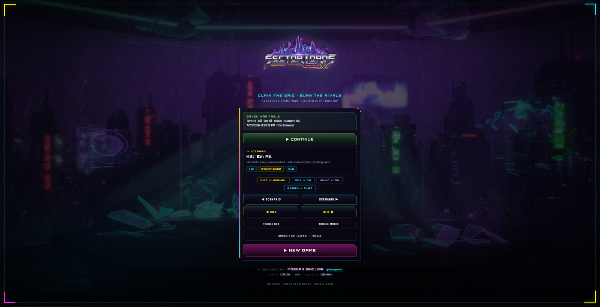
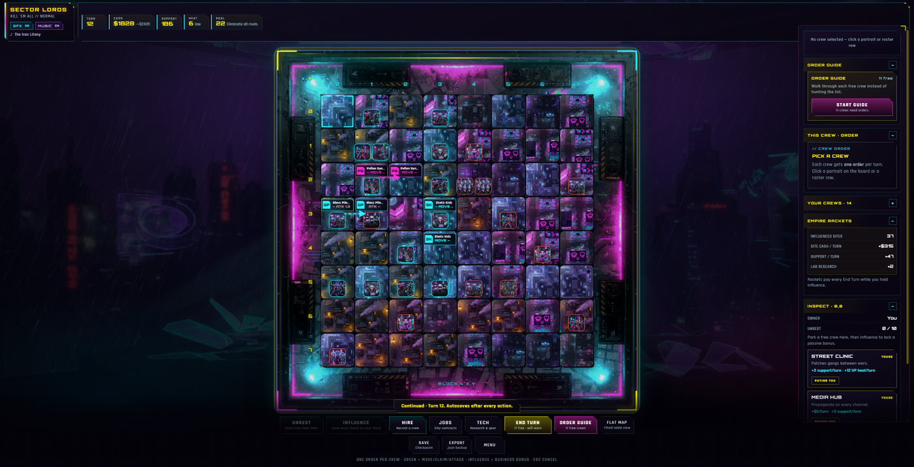
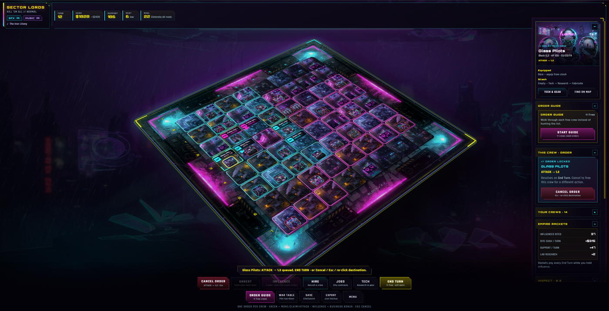

# Sector Lords

A browser-based cyberpunk crime-war strategy game **inspired by** classic 1990s overlord strategy (*Chaos Overlords* vibes — original build, not an official remake).

**Play:** https://sectorlords.com  
**Also:** https://sector-lords.pages.dev  
**Author:** Morgan Sinclair ([@morganinc](https://x.com/morganinc))

Also used as a **Grok Build (Grok 4.5) evaluation**: ship a multi-system game under human direction. Notes live in the Obsidian vault under [`docs/`](docs/00%20Home.md).

Cyberpunk crime war on a city grid: hire weird gangs, claim sectors, influence sites, raise **unrest** (and police heat), card-style combat, full turn resolve.

## Screenshots

| Menu | War table | In-game |
|:----:|:---------:|:-------:|
|  |  |  |

## Stack

- **Vite + TypeScript**
- **Phaser 4** (scene shell)
- **Pure engine** in `src/engine` (Vitest)
- **Hybrid board** `src/app-tabletop` (DOM + CSS 3D war table)
- **Cloudflare Pages** (`sector-lords`)
- Art notes: `art/STYLE.md`

## Run

```bash
npm install
npm run dev      # http://localhost:5173
npm test
npm run build
npm run deploy   # build + wrangler pages deploy
```

## How to play (hybrid — primary)

1. **Menu** → Jack In / Continue (scenario + difficulty + SFX/music).
2. **Pick a crew** (board portrait, roster, or Order Guide).
3. **One order per crew:** green neighbors = Move / Claim / Attack; or Influence / Unrest / Research on your turf.
4. **Hire / Jobs / Tech** drawers; **End Turn** resolves AI, combat cards, economy, events.
5. Idle crews trigger an **End Turn warning**.
6. **Mobile:** full-width board, **Crew** slide-over, pinch-zoom.

Blocks are **X,Y** (edge labels on the board). Balance: `docs/BALANCE.md`.

### Tech loop

Influence a **Lab** → Research → Fabricate → Equip → stronger fights.

## Agent / contributor rules

- **[AGENTS.md](./AGENTS.md)** — coding agents (Grok Build, Cursor, etc.)
- **[CONTRIBUTING.md](./CONTRIBUTING.md)** — human contributors
- Obsidian vault: **[docs/00 Home.md](./docs/00%20Home.md)**

## Project layout

```
src/engine/        # pure rules (no DOM/Phaser)
src/content/       # gangs, sites, events, items JSON
src/ai/            # heuristic AI
src/app/           # GameController, Menu, Game3D HUD
src/app-tabletop/  # war table board
docs/              # Obsidian progress / decisions
public/assets/     # art + audio
art/               # style bible + prompts
tests/             # vitest
```

## License / IP

Source code: **[MIT](./LICENSE)** (Copyright © 2026 Morgan Sinclair).

Game systems and art are original. Project is **inspired by** classic overlord-strategy games; **not** affiliated with Stick Man Games, New World Computing, or any rights holders of *Chaos Overlords*. Do not ship trademarked original assets from that game.

Music credited to Gemini on the in-game menu.
